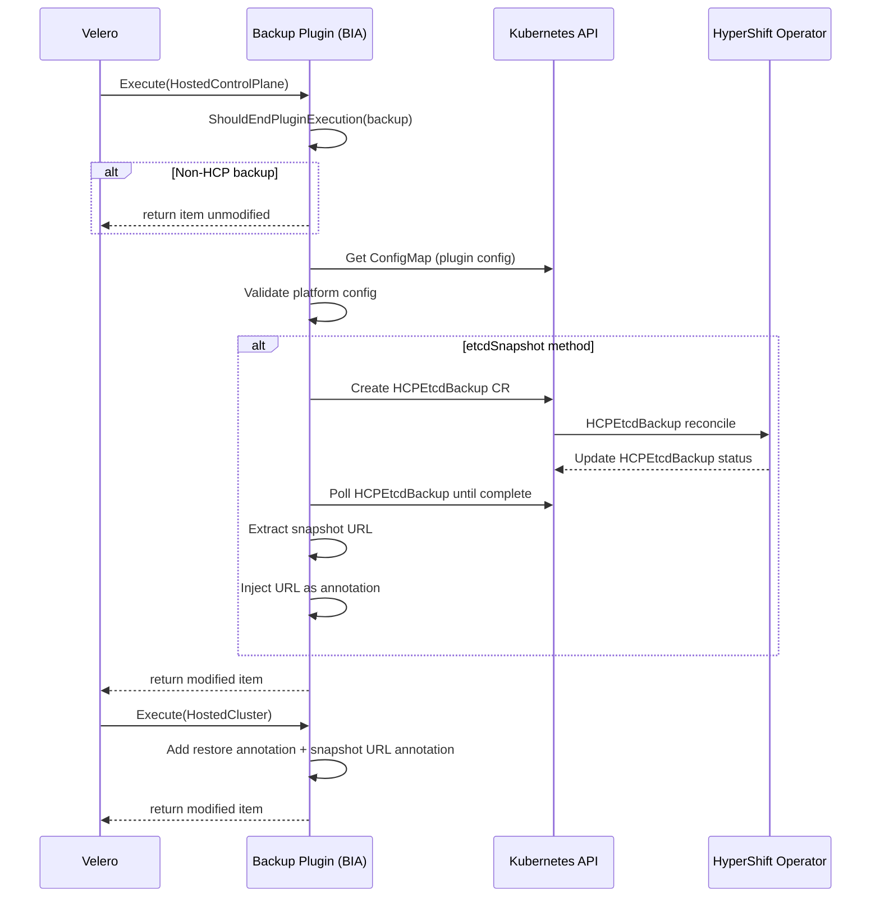
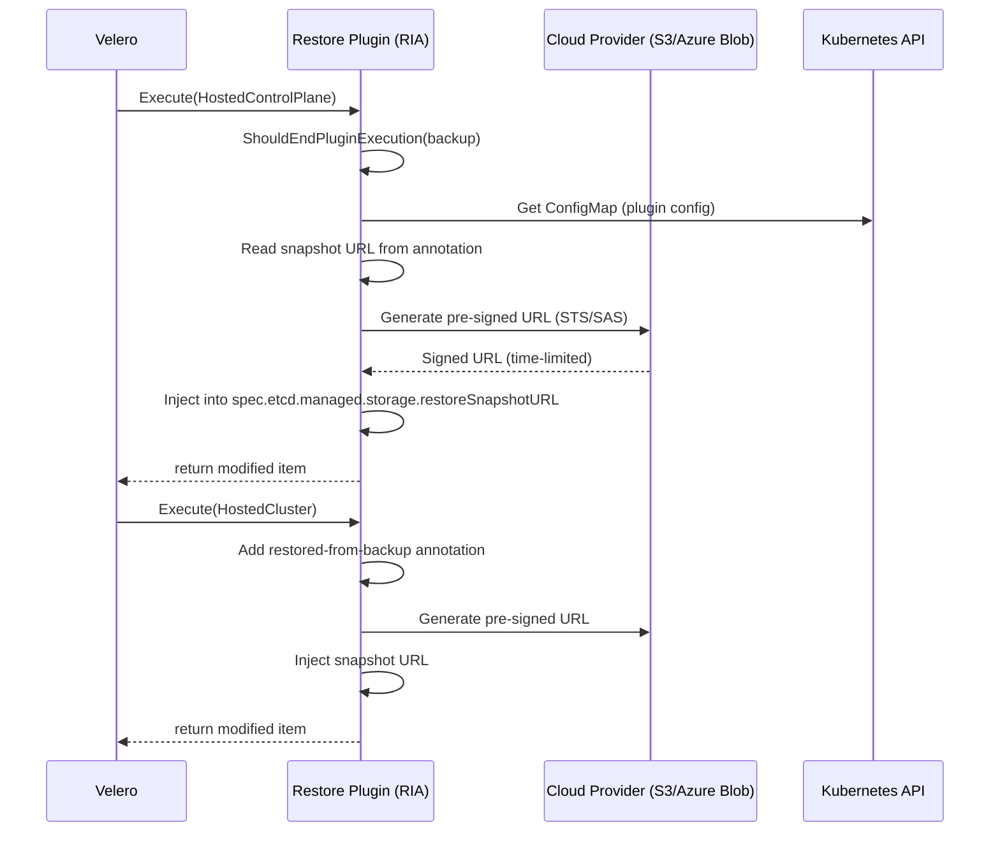

# Architecture

HyperShift OADP Plugin is a Velero plugin that enables backup and restore of Hosted Control Planes (HCP) on OpenShift. It runs as a gRPC subprocess inside the Velero server pod, intercepting Kubernetes resources during backup and restore to apply HCP-specific logic: etcd snapshot coordination, cloud credential resolution, and ordered control plane recovery.

## Design Overview

The plugin intercepts Velero's per-resource callbacks (Backup Item Action and Restore Item Action) to inject HCP-aware logic into an otherwise HCP-unaware backup engine. The core design is a **kind-based dispatch**: the plugin registers interest in specific Kubernetes resource kinds, and when Velero encounters one during backup or restore, the plugin's `Execute()` method routes it to the appropriate handler.

Backup adds metadata (etcd snapshot URLs, restore annotations) and excludes resources that should not be persisted (pods, etcd PVCs when using snapshot method). Restore reads that metadata back, generates time-limited signed URLs for etcd snapshot download, and injects them into the restored resources so HyperShift can bootstrap the control plane from the snapshot.

The plugin is stateless across Velero invocations — all durable coordination state flows through Kubernetes resources (annotations, CRs). Within a single backup run, the etcd orchestrator may cache results in memory to avoid duplicate work (see Design Invariants). Retry safety comes from explicit idempotency guards (`IsCreated()` checks, annotation-based deduplication), not from statelessness alone.

## Key Concepts

- **OADP** — OpenShift API for Data Protection. The OpenShift operator that deploys and manages Velero.
- **Velero** — the upstream backup/restore engine. Processes Kubernetes resources and invokes plugins for custom logic.
- **Backup Item Action (BIA)** — a Velero plugin hook called for each resource during backup. Can modify the item before Velero persists it.
- **Restore Item Action (RIA)** — a Velero plugin hook called for each resource during restore. Can modify the item before Velero applies it to the cluster, or skip it entirely.
- **HostedCluster (HC)** — the top-level CR representing a hosted OpenShift cluster. Lives in the management cluster.
- **HostedControlPlane (HCP)** — the control plane components (etcd, kube-apiserver, etc.) running as pods in a dedicated namespace on the management cluster.
- **NodePool** — a set of compute worker nodes for a hosted cluster.
- **HCPEtcdBackup** — a CR that triggers HyperShift to take an etcd snapshot and upload it to object storage.

## Core Components

| Component | Directory | Role |
|-----------|-----------|------|
| **Plugin Entry Point** | `main.go` | Registers the BIA and RIA with Velero's plugin framework via gRPC. |
| **Backup Plugin** | `pkg/core/backup.go` | BIA implementation. Dispatches on resource `kind` to run backup-specific logic. |
| **Restore Plugin** | `pkg/core/restore.go` | RIA implementation. Dispatches on resource `kind` to run restore-specific logic. |
| **Backup Validation** | `pkg/core/validation/` | Validates platform configuration and plugin config before backup proceeds. |
| **Type Registration** | `pkg/core/types/types.go` | Declares which Kubernetes resource kinds the plugin reacts to — the plugin's dispatch table, not a passive inventory. |
| **Common Utilities** | `pkg/common/` | Shared constants, kind definitions, credential helpers, scheme registration. |
| **Etcd Backup Orchestrator** | `pkg/etcdbackup/` | Creates `HCPEtcdBackup` CRs, waits for completion, extracts the snapshot URL. |
| **S3 Pre-signed URLs** | `pkg/s3presign/` | AWS S3 URL pre-signing with STS assume-role support for etcd snapshot download. |
| **Azure Blob SAS** | `pkg/azblobsas/` | Azure Blob SAS token generation via AAD delegation for etcd snapshot download. |
| **AWS Platform** | `pkg/platform/aws/` | AWS-specific backup/restore logic. |
| **Agent Platform** | `pkg/platform/agent/` | Agent (BareMetal) platform logic, including `ClusterDeployment` migration tasks. |
| **Version** | `pkg/version/` | Build metadata (git branch, commit, build date). Populated at init time. |

## Design Invariants

- The resource lists in `pkg/core/types/types.go` are **dispatch tables, not inventory**. Each entry causes Velero to invoke the plugin for that kind. Adding a kind without a corresponding `Execute()` case wastes cycles; removing one silently drops handling.
- All cluster-mutating operations inside `Execute()` must be **idempotent**. The method is called once per matching resource — multiple resources of the same kind trigger multiple calls. The etcd orchestrator uses `IsCreated()` guards and caches results to avoid duplicate work.
- Velero **strips `status`** from items during restore. The plugin bridges this by copying critical status fields (etcd snapshot URL) into annotations during backup and reading them back during restore. This is deliberate — do not remove the annotation logic.
- The plugin **does not manage credentials**. Cloud credentials are resolved from the environment: AWS via STS assume-role, Azure via AAD/SAS delegation, standalone Velero via the `cloud-credentials` secret.

## Backup and Restore Flows

Both flows start with a guard check (`ShouldEndPluginExecution`) that verifies the backup targets a HyperShift namespace. If not, the plugin returns the item unmodified.

### Backup Dispatch

| Kind | Action |
|------|--------|
| `HostedControlPlane` | Validates platform config. If etcd method is `etcdSnapshot`, creates `HCPEtcdBackup` CR and waits for completion. Injects snapshot URL as annotation. |
| `HostedCluster` | Adds restore annotation. Injects etcd snapshot URL into annotation and `status.lastSuccessfulEtcdBackupURL`. |
| `Pod` | Etcd pods: excluded entirely (`etcdSnapshot` method) or labeled for FSBackup (`volumeSnapshot` method). |
| `ClusterDeployment` | Agent platform only: runs migration tasks. |
| `DataVolume` / `PVC` | Excludes KubeVirt RHCOS volumes. Excludes etcd data PVCs with `etcdSnapshot` method. |

### Etcd Snapshot Annotation

Velero strips `status` from items during restore. To preserve the etcd snapshot URL across the backup/restore boundary, the plugin writes it to the annotation `hypershift.openshift.io/etcd-snapshot-url` during backup. The restore plugin reads this annotation to inject the URL back into the spec. This is a deliberate design choice — not a bug or workaround to remove.

### Restore Dispatch

| Kind | Action |
|------|--------|
| `HostedControlPlane` | Validates platform config. Reads snapshot URL from annotation, pre-signs it (S3 or Azure Blob SAS), injects into `spec.etcd.managed.storage.restoreSnapshotURL`. |
| `HostedCluster` | Adds `hypershift.openshift.io/restored-from-backup` annotation. Pre-signs and injects snapshot URL. |
| `Pod` | Skipped entirely (`WithoutRestore`). Pods are recreated by controllers. |
| `StatefulSet` | Etcd StatefulSet skipped with `etcdSnapshot` method. Etcd bootstraps from snapshot URL. |
| `ClusterDeployment` | Sets `spec.preserveOnDelete = true` to prevent Hive cleanup during restore. |

### Credential Resolution During Restore

The restore plugin must generate time-limited signed URLs for etcd snapshot download. Credential resolution depends on the platform:

- **AWS** — assumes an IAM role via STS (`s3presign` package), then generates a pre-signed S3 URL.
- **Azure** — obtains an AAD token and generates a SAS-signed Blob URL (`azblobsas` package).
- **Standalone Velero** (no DPA) — falls back to the `cloud-credentials` secret in the Velero namespace.

## Configuration

The plugin reads a ConfigMap named `hypershift-oadp-plugin-config` (constant `common.PluginConfigMapName`). The namespace is resolved from the pod's service account mount (`/var/run/secrets/kubernetes.io/serviceaccount/namespace`) — this is always the Velero namespace since the plugin runs as a subprocess inside the Velero server pod.

| Key | Values | Default | Effect |
|-----|--------|---------|--------|
| `etcdBackupMethod` | `volumeSnapshot`, `etcdSnapshot` | `volumeSnapshot` | Controls whether etcd is backed up via CSI volume snapshots or via an `HCPEtcdBackup` CR. |
| `hoNamespace` | any namespace | `hypershift` | Overrides the namespace where the HyperShift Operator runs. |

If the ConfigMap does not exist, the plugin proceeds with defaults — it does not fail.

## Platform Support

- **AWS** — STS credential resolution for backup, S3 pre-signed URL generation for restore.
- **Azure** — SAS URL signing for backup, AAD token + SAS delegation for restore.
- **Agent / BareMetal** — `ClusterDeployment` migration tasks on backup, `PreserveOnDelete` on restore.
- **KubeVirt** — excludes RHCOS `DataVolume`s from backup.
- **OpenStack** — resource types registered, no platform-specific logic.
- **IBM PowerVS** — resource types registered, no platform-specific logic.

## Key Dependencies

| Dependency | Why |
|------------|-----|
| `github.com/openshift/hypershift/api` | HCP, HC, NodePool API types. Must stay in sync with upstream. |
| `github.com/vmware-tanzu/velero` | Plugin framework, BIA/RIA interfaces, resource selector. |
| `github.com/openshift/hive/apis` | `ClusterDeployment` type for Agent platform. |
| `sigs.k8s.io/controller-runtime` | Kubernetes client used for all cluster interactions. |

## Failure Modes

The plugin fails explicitly — errors propagate to Velero, which marks the backup or restore as `PartiallyFailed` or `Failed`.

| Failure | What Happens | Recovery |
|---------|-------------|----------|
| **ConfigMap missing** | Plugin proceeds with defaults (`volumeSnapshot`, `hypershift` namespace). Not an error. | Create the ConfigMap if non-default behavior is needed. |
| **`ShouldEndPluginExecution` returns true** | Plugin returns the item unmodified. This is normal for non-HCP backups — no error is raised. | No action needed. |
| **HCPEtcdBackup CR creation fails** | `CreateEtcdBackup` returns an error. Velero marks the backup as failed. | Check RBAC (the plugin SA needs create permission for `HCPEtcdBackup`), verify the `BackupStorageLocation` exists, and check etcd health. |
| **HCPEtcdBackup times out or reports unhealthy etcd** | `VerifyInProgress` or `WaitForCompletion` returns an error after polling timeout. | Investigate etcd pod health in the HCP namespace. The `HCPEtcdBackup` CR's `.status.conditions` contain the failure reason. |
| **Pre-signed URL generation fails at restore time** | Restore plugin returns an error for the `HostedControlPlane` or `HostedCluster` item. | Verify cloud credentials are valid and the snapshot object still exists in the bucket. For AWS: check the STS assume-role chain. For Azure: check AAD token and SAS delegation permissions. |
| **Credential secret not found** | Standalone Velero (no DPA) path fails if `cloud-credentials` secret is missing. | Create the secret in the Velero namespace with the expected keys. |

## Backup Sequence

## Restore Sequence

## Tradeoffs and Decisions

| Decision | Tradeoff | Why |
|----------|----------|-----|
| **Annotations for cross-boundary data** | Couples backup and restore through implicit annotation contracts instead of a dedicated CR. | Velero strips `status` on restore — annotations are the only field that survives the round-trip without upstream changes. A dedicated CR would require CRD management and lifecycle hooks the plugin cannot own. |
| **Pre-signed URLs generated at restore time** | Restore requires valid cloud credentials and network access to the object store. A credential or network failure during restore blocks recovery. | Embedding long-lived URLs at backup time would create a security risk (leaked URLs) and a staleness problem (URLs expire, buckets move). Generating at restore time keeps the window short and uses the current credential context. |
| **Kind-based dispatch in `types.go`** | Adding a new resource to backup/restore requires changes in two places (type registration + handler). | Explicit registration prevents accidental processing of resources the plugin does not understand. The dispatch table is the plugin's contract with Velero — making it implicit would hide the blast radius of changes. |
| **Vendored dependencies** | Larger repository, manual vendor updates. | Required by OpenShift CI (Prow) builds. Ensures reproducible builds without network access during CI. |
| **Single plugin binary** | All platform logic (AWS, Azure, Agent, KubeVirt) ships in one binary even when only one platform is used. | Velero's plugin model loads one binary per plugin registration. Splitting per-platform would require multiple registrations and complicate OADP's deployment. The binary size overhead is negligible. |
| **`etcdSnapshot` vs `volumeSnapshot` methods** | Two code paths to maintain and test. | `volumeSnapshot` is simpler (CSI handles it) but requires CSI drivers and compatible storage. `etcdSnapshot` works universally via the HyperShift operator but requires the `HCPEtcdBackup` CRD and object storage access. Customers need both options depending on their infrastructure. |

## Further Reading

- [DataMover Multi-Provider Integration](docs/references/DataMover/DataMover-implementation.md) — multi-platform DataMover flow and troubleshooting.
- [HCPEtcdBackup Implementation](docs/references/HCPEtcdBackup/HCPEtcdBackup-implementation.md) — etcd backup CR orchestration details.
- [AGENTS.md](AGENTS.md) — AI agent guidance and plugin framework lifecycle.
- [CONTRIBUTING.md](CONTRIBUTING.md) — PR process, CI, and testing requirements.
