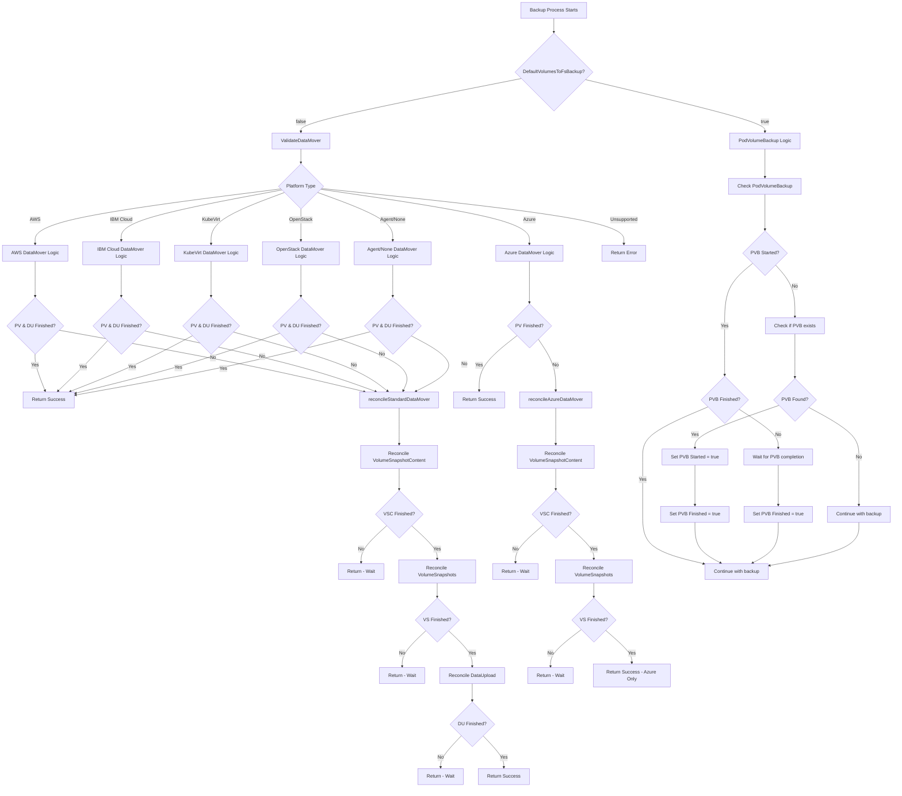
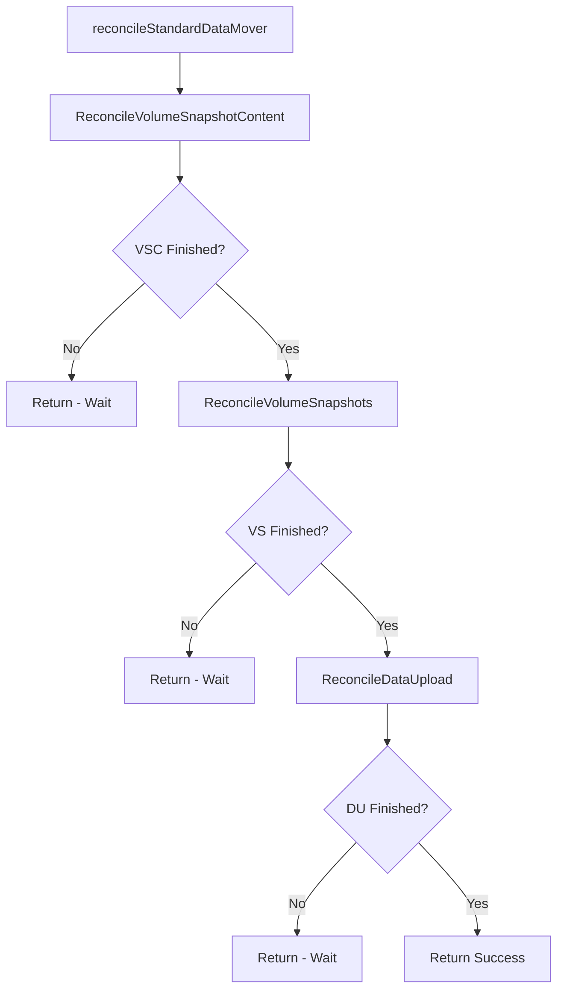
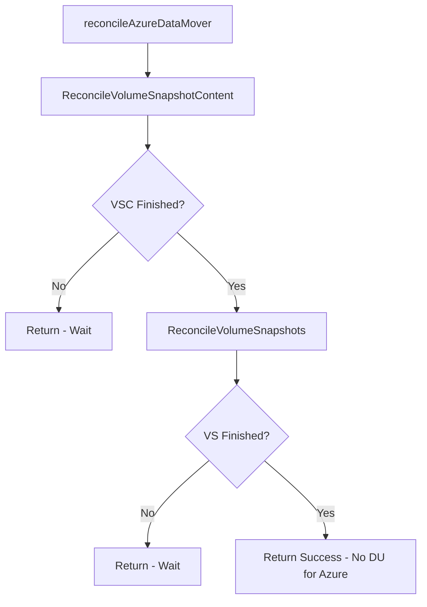
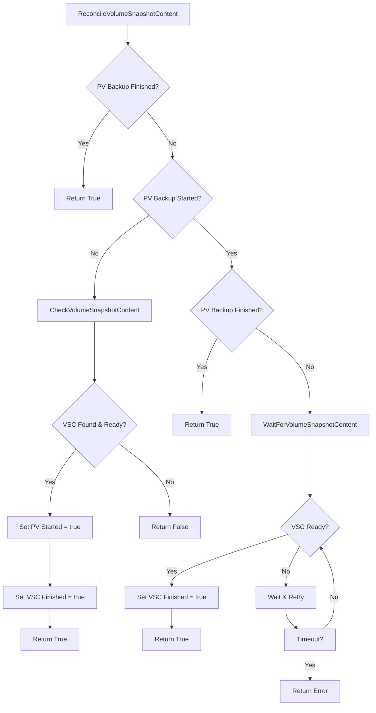
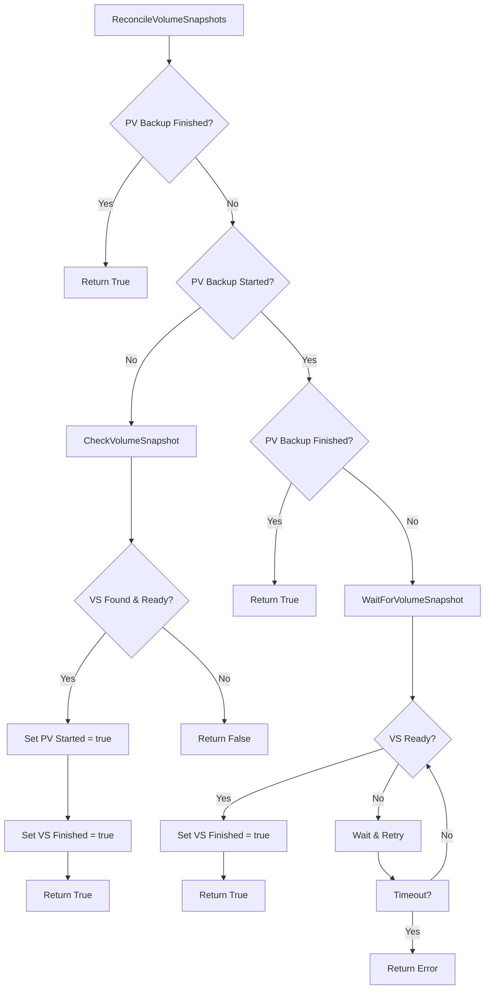
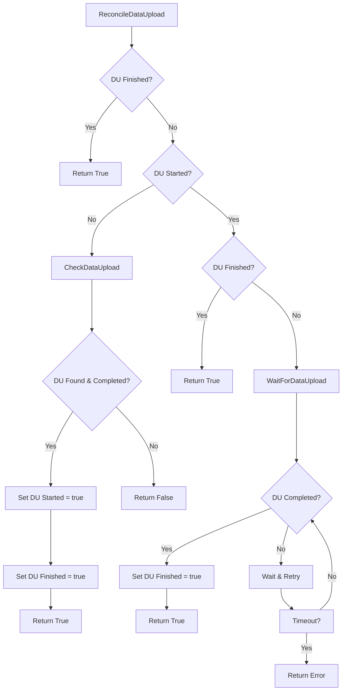
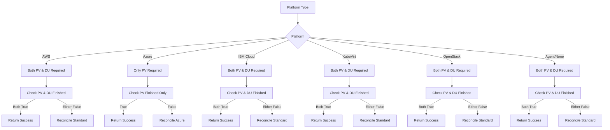

# DataMover Multi-Provider Integration

## Table of Contents
- [Overview](#overview)
- [Architecture](#architecture)
- [Platform Support](#platform-support)
- [Flow Diagrams](#flow-diagrams)
- [Implementation Details](#implementation-details)
- [Configuration](#configuration)
- [Testing](#testing)
- [Troubleshooting](#troubleshooting)

## Overview

The DataMover Multi-Provider Integration (PR [#91](https://github.com/openshift/hypershift-oadp-plugin/pull/91)) implements a comprehensive solution for managing data movement operations across different cloud platforms in the hypershift-oadp-plugin. This feature enables platform-specific validation and reconciliation logic to ensure reliable backup and restore operations.

### Key Features

- **Multi-Platform Support**: Native support for AWS, Azure, IBM Cloud, KubeVirt, OpenStack, Agent, and None platforms
- **Platform-Specific Logic**: Different reconciliation strategies optimized for each platform's capabilities
- **State Management**: Robust tracking of backup progress with boolean flags
- **Timeout Handling**: Configurable timeouts for DataUpload operations
- **High Availability**: HA-aware reconciliation logic for production environments
- **Backward Compatibility**: Maintains existing PodVolumeBackup logic for fsBackup scenarios

## Architecture

The DataMover integration follows a modular architecture with clear separation of concerns:

### Core Components

1. **BackupPluginValidator**: Main validation interface
2. **Platform-Specific Handlers**: Custom logic for each supported platform
3. **Reconciliation Engine**: Manages resource state and progress tracking
4. **Resource Monitors**: Track VolumeSnapshotContent, VolumeSnapshot, and DataUpload resources

### State Management

The system uses boolean flags to track progress:
- `PVBackupStarted`: Indicates if PV backup has begun
- `PVBackupFinished`: Indicates if PV backup is complete
- `DUStarted`: Indicates if DataUpload has begun
- `DUFinished`: Indicates if DataUpload is complete

## Platform Support

### Supported Platforms

| Platform | PV Required | DU Required | Reconciliation Strategy |
|----------|-------------|-------------|------------------------|
| AWS | ✅ | ✅ | Standard |
| Azure | ✅ | ❌ | Azure-specific |
| IBM Cloud | ✅ | ✅ | Standard |
| KubeVirt | ✅ | ✅ | Standard |
| OpenStack | ✅ | ✅ | Standard |
| Agent | ✅ | ✅ | Standard |
| None | ✅ | ✅ | Standard |

### Platform-Specific Requirements

- **Azure**: Only requires VolumeSnapshot operations (no DataUpload)
- **Other Platforms**: Require both VolumeSnapshot and DataUpload operations
- **All Platforms**: Support high availability configurations

## Flow Diagrams

### Main Backup Flow

The primary backup flow determines whether to use DataMover or traditional PodVolumeBackup logic:



### Reconciliation Strategies

The system implements two main reconciliation strategies:

#### Standard DataMover Reconciliation

Used by most platforms (AWS, IBM Cloud, KubeVirt, OpenStack, Agent, None):



#### Azure DataMover Reconciliation

Azure-specific reconciliation (no DataUpload required):



### Resource Reconciliation Details

#### VolumeSnapshotContent Reconciliation

Manages the lifecycle of VolumeSnapshotContent resources:



#### VolumeSnapshot Reconciliation

Handles VolumeSnapshot resource monitoring:



#### DataUpload Reconciliation

Manages DataUpload resource lifecycle (not used for Azure):



### Platform-Specific Logic Flow

Shows how different platforms are handled:



## Implementation Details

### Core Functions

#### ValidateDataMover
```go
func (p *BackupPluginValidator) ValidateDataMover(ctx context.Context, hcp *hyperv1.HostedControlPlane, backup *velerov1.Backup) error
```

Main entry point that:
- Validates platform type
- Checks current state
- Routes to appropriate reconciliation strategy
- Manages timeout and error handling

#### Reconciliation Functions

**Standard DataMover:**
```go
func (p *BackupPluginValidator) reconcileStandardDataMover(ctx context.Context, hcp *hyperv1.HostedControlPlane) error
```

**Azure DataMover:**
```go
func (p *BackupPluginValidator) reconcileAzureDataMover(ctx context.Context, hcp *hyperv1.HostedControlPlane) error
```

### Resource Monitoring

The system monitors three key resource types:

1. **VolumeSnapshotContent**: Kubernetes snapshot content resources
2. **VolumeSnapshot**: Kubernetes snapshot resources
3. **DataUpload**: Velero v2alpha1 data upload resources

### State Management

State is tracked using boolean pointers:
- `PVBackupStarted`: Tracks if PV backup has initiated
- `PVBackupFinished`: Tracks if PV backup is complete
- `DUStarted`: Tracks if DataUpload has initiated
- `DUFinished`: Tracks if DataUpload is complete

## Configuration

### Plugin Configuration

The DataMover supports several configuration options:

```yaml
dataUploadTimeout: "15"      # Timeout in minutes for DataUpload operations
dataUploadCheckPace: "30"    # Check interval in seconds
migration: "false"           # Migration mode flag
readoptNodes: "false"        # Node readoption flag
managedServices: "false"     # Managed services flag
```

### High Availability Configuration

For HA environments, set the `HA` flag to `true` in the validator:

```go
validator := &BackupPluginValidator{
    HA: true,
    // ... other configuration
}
```

## Testing

### Test Coverage

The implementation includes comprehensive test coverage:

#### Unit Tests
- **Platform Validation**: Tests for all supported platforms
- **State Management**: Tests for finished vs in-progress states
- **Edge Cases**: Tests for nil values and unsupported platforms
- **High Availability**: Tests for HA scenarios
- **Timeout Configuration**: Tests for different timeout settings

#### Integration Tests
- **Realistic Reconciliation**: Tests with actual Kubernetes resources
- **Resource Monitoring**: Tests for VolumeSnapshotContent, VolumeSnapshot, and DataUpload
- **Error Handling**: Tests for timeout and error scenarios

### Test Structure

```go
func TestValidateDataMoverPlatformValidation(t *testing.T)
func TestValidateDataMoverWithDifferentPlatforms(t *testing.T)
func TestValidateDataMoverWithFinishedStates(t *testing.T)
func TestValidateDataMoverWithClient(t *testing.T)
func TestValidateDataMoverEdgeCases(t *testing.T)
func TestValidateDataMoverWithHighAvailability(t *testing.T)
func TestValidateDataMoverWithDifferentTimeouts(t *testing.T)
func TestValidateDataMover_AWS_Reconciliation(t *testing.T)
```

## Troubleshooting

### Common Issues

#### Timeout Errors
- **Symptom**: `context deadline exceeded` errors
- **Solution**: Increase `dataUploadTimeout` configuration
- **Check**: Verify network connectivity and resource availability

#### Platform Validation Errors
- **Symptom**: `unsupported platform type` errors
- **Solution**: Verify platform type in HostedControlPlane spec
- **Check**: Ensure platform is in supported list

#### Resource Not Found
- **Symptom**: VolumeSnapshotContent or VolumeSnapshot not found
- **Solution**: Verify CSI snapshot controller is installed
- **Check**: Ensure snapshot resources are being created

#### State Management Issues
- **Symptom**: Infinite loops or stuck reconciliation
- **Solution**: Check boolean flag initialization
- **Check**: Verify resource status and conditions

### Debugging

Enable debug logging to troubleshoot issues:

```go
log.SetLevel(logrus.DebugLevel)
```

### Monitoring

Monitor these key metrics:
- Reconciliation duration
- Resource completion rates
- Error rates by platform
- Timeout occurrences

### Log Analysis

Key log messages to monitor:
- `"Reconciling standard data mover for HCP"`
- `"VolumeSnapshotContent is done"`
- `"VolumeSnapshot is done"`
- `"DataUpload is done"`
- `"error reconciling"`

## Conclusion

The DataMover Multi-Provider Integration provides a robust, scalable solution for managing data movement operations across different cloud platforms. The implementation ensures reliable backup and restore operations while maintaining backward compatibility and supporting high availability configurations.

The comprehensive test coverage and detailed flow diagrams make this implementation suitable for production environments across all supported platforms.